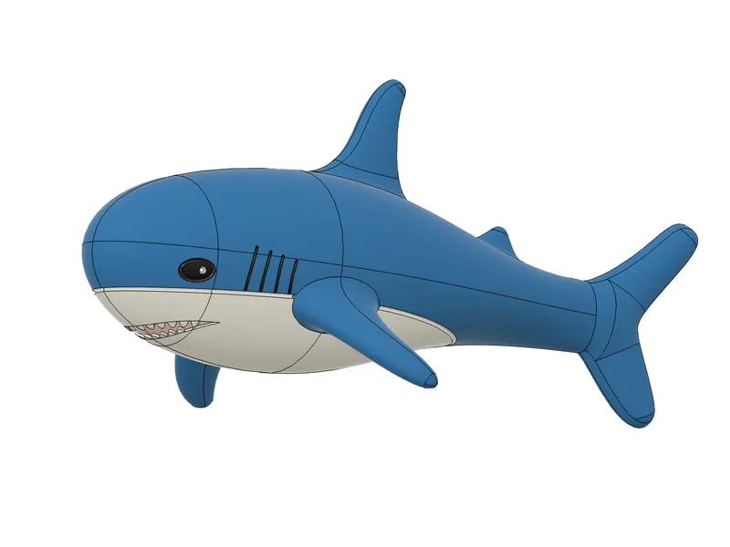

# This is a (vaguely accurate) model of the Ikea Blåhaj! 🦈
I made this because I've wanted a decent model for years, but all the ones online have either been inaccurate, or not 3d printer friendly. 

Three STL's are provided, and a STEP:

- Shark.STEP (a source STEP file)
- Shark.F3D (a source Fusion archive, too large to upload, contact me if you want it! :p)

- SharkFullNormal.STL (an exported stl of Shark.STEP)
- SharkHalfNormal.STL (half of SharkFullnormal.STL, for easy printing)
- SharkHalfChocolate.STL (a half-shark optimised for chocolate printing! :3)

## license: do whatever you want so long as you're cool? also attribution pls. 

